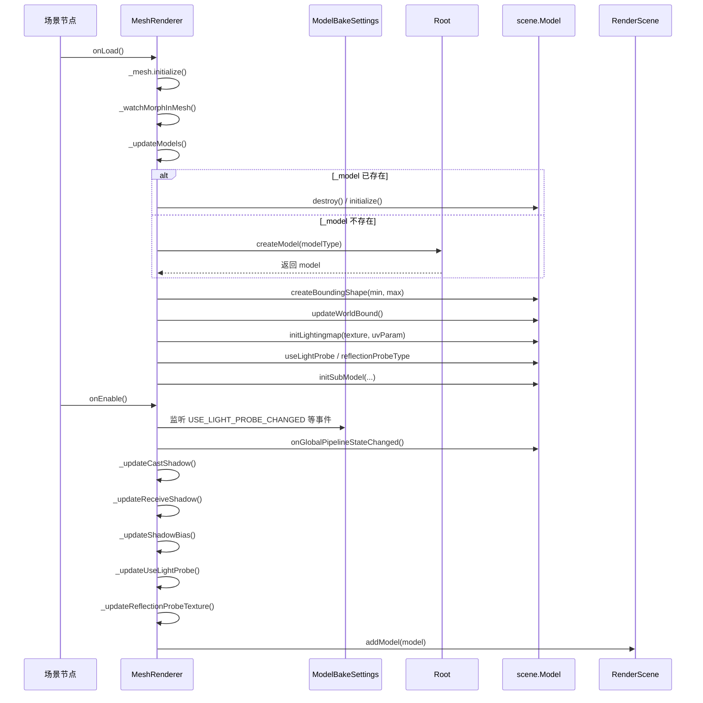

## 前言

本文回答的问题是一个问题：Mesh资源是怎么被装配成可渲染单元的。
## 一、双端实现

Cocos 有一个特殊设计：**渲染核心逻辑在 TS 和 C++ 各有一套等价实现**。

用户创建的 MeshRenderer 组件在 TS 层，但底层 Model 的创建和更新在不同平台走不同路径：

Web 平台（WebGL/WebGPU）： TS 代码 → TS 版 Model/SubModel → TS 版 GFX 抽象层 → WebGL/WebGPU API → GPU。

原生平台（Vulkan/Metal/GLES3）： TS 代码 → JSB 绑定 → C++ 版 Model/SubModel → C++ 版 GFX 抽象层 → 图形 API → GPU。

TS 层的 MeshRenderer 代码是**平台无关的**，它不关心底层是 TS 实现还是 C++ 实现。这个切换由 JSB 绑定层自动完成。
## 二、MeshRenderer时序图



## 三、关键数据结构

MeshRenderer的装配有四个层级：

Mesh → RenderingSubMesh → SubModel → Model

```
Mesh（资源文件，.mesh 格式）
├── _struct: IStruct           ← 描述文件：顶点布局、子网格信息、包围盒等
│   ├── vertexBundles[]        ← 顶点属性描述（位置、法线、UV 等）
│   ├── primitives[]           ← 子网格描述（每个 primitive 对应一个 RenderingSubMesh）
│   │   ├── vertexBundleIndices  ← 引用哪些 vertexBundle
│   │   ├── indexView            ← 索引数据在 _data 中的位置
│   │   └── primitiveMode        ← 三角形/线/点
│   └── minPosition / maxPosition
│
└── _data: Uint8Array          ← 原始字节：顶点 + 索引的实际数据

RenderingSubMesh（GPU 资源封装）
├── 从 Mesh 的 _data 中提取顶点和索引
├── 创建 GPU Buffer（VBO/IBO）
└── 创建 InputAssembler（顶点布局 + 索引缓冲）

SubModel（渲染单元，一对一对应 RenderingSubMesh）
├── 引用 RenderingSubMesh（几何数据）
├── passes[]                   ← 材质 Pass 列表
├── shaders[]                  ← 着色器列表
└── descriptorSet              ← 描述符集（UBO 绑定）

Model（完整渲染对象，持有多个 SubModel）
├── subModels: SubModel[]      ← 一个 Model 可以包含多个 SubModel
│   ├── SubModel0 → 对应 Mesh.renderingSubMeshes0
│   ├── SubModel1 → 对应 Mesh.renderingSubMeshes1
│   └── …
├── node: Node                 ← 关联的场景节点（transform 来源）
├── worldBounds: AABB          ← 世界空间包围盒
└── 其他渲染属性（阴影、光照探针、反射探针等）
```
## 四、重要文件汇总
| 文件 | 含义 |
|---|---|
| `cocos/3d/framework/mesh-renderer.ts` | MeshRenderer 组件，用户创建物体的 TS 入口 |
| `cocos/3d/assets/mesh.ts` | Mesh 资源，封装 VBO/IBO + 子网格描述 |
| `cocos/asset/assets/rendering-sub-mesh.ts` | RenderingSubMesh，GPU 资源封装（VBO/IBO/InputAssembler） |
| `cocos/render-scene/scene/model.ts` | TS 版 Model，最小可渲染单元 |
| `cocos/render-scene/scene/submodel.ts` | TS 版 SubModel，持有 Pass 和着色器 |
| `native/cocos/scene/Model.h` | C++ 版 Model，TS 版的高性能等价实现 |
| `native/cocos/scene/SubModel.h` | C++ 版 SubModel |
## 五、总结
MeshRenderer 的数据流可以概括为：**Mesh 资源拆解为 RenderingSubMesh → 装配为 SubModel → 聚合成 Model → 注册到 RenderScene → 管线渲染**。
在 Web 平台，这条链路全程走 TS 实现；在原生平台，TS 层只负责创建和配置，底层的更新和渲染由 C++ 版等价实现接管。两套实现接口一致，JSB 绑定层自动切换，上层代码无需关心平台差异。
