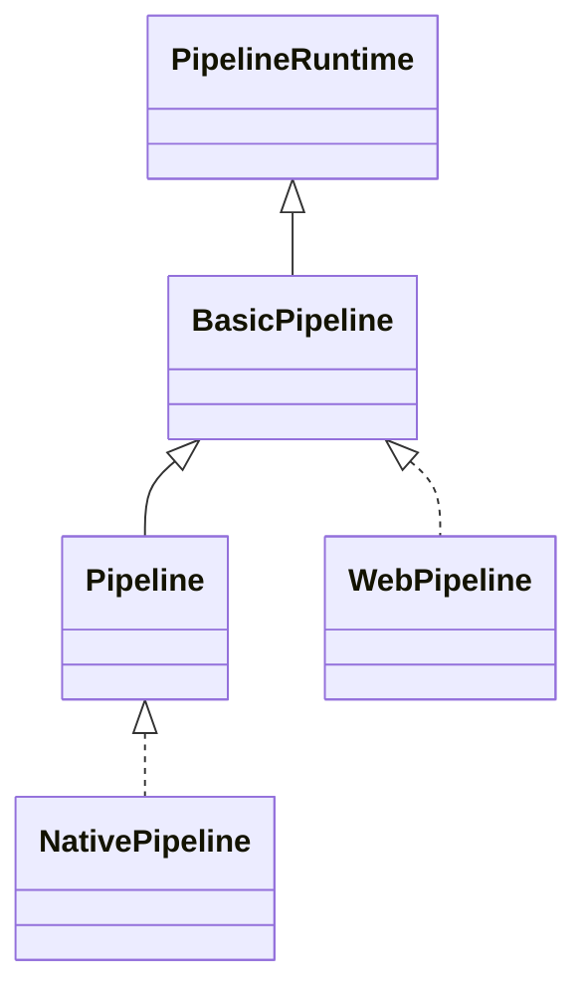

## 前言

旧管线（ForwardPipeline、DefferedPipeline）的一帧渲染数据流是 Pipeline → Flow → Stage → Queue。

这一篇讲新管线（Custom Pipeline），它用RenderGraph替换了旧管线的固定层次，让开发者以声明式的方式构建渲染流程。

**注：本文基于cocos引擎 4.0.0之前版本。**

**新旧管线核心差异：**

| 维度 | 旧管线 | 新管线 |
|---|---|---|
| 架构 | 固定流程：Pipeline → Flow → Stage → Queue | 可编程渲染图：RenderGraph + PipelineBuilder |
| 灵活性 | 低，需继承并重写 Flow/Stage | 高，可自由组合 Pass、Subpass、Compute |
| 资源管理 | 手动创建 Framebuffer，管线内部缓存 | 资源注册到 ResourceGraph，引擎自动管理状态转换和 Barrier |
| 渲染流程组织 | 以对象类型分类（不透明、透明、阴影等） | 以 Pass 为节点，Queue 为子节点，Scene 为叶子节点 |
| 扩展方式 | 继承 RenderPipeline 并组装 Flow/Stage | 实现 PipelineBuilder，在 setup() 中声明式构建 |

新管线的核心是 **RenderGraph**——一张有向无环图，节点是渲染 Pass，边是资源依赖。一帧渲染分三步：

```
PipelineBuilder.setup()  →  声明式构建 RenderGraph
↓
Pipeline.compile()       →  编译 RenderGraph，分析依赖
↓
Executor.execute()       →  深度优先遍历 RenderGraph，执行渲染
```

## 一、类层次结构

新管线有三层接口：

```ts
// 第一层：运行时接口
interface PipelineRuntime {
    activate(swapchain: Swapchain): boolean;
    render(cameras: Camera[]): void;
    destroy(): boolean;
}

// 第二层：基础管线，提供 RenderGraph 构建能力
interface BasicPipeline extends PipelineRuntime {
    addRenderPass(width, height, layoutName?): BasicRenderPassBuilder;
    addQueue(hint?, phaseName?, passName?): RenderQueueBuilder;
    addScene(camera, sceneFlags, light?, scene?): SceneBuilder;
    beginFrame(): void;
    endFrame(): void;
}

// 第三层：完整管线，增加 Compute、Subpass、StorageBuffer 等高级特性
interface Pipeline extends BasicPipeline {
    addComputePass(passName?): ComputePassBuilder;
    addRenderSubpass(subpassName): RenderSubpassBuilder;
    addStorageBuffer(name, accessType, slotName): void;
    addUploadPass(uploadPairs): void;
}
```

Web 平台实现 `BasicPipeline`，原生平台（C++）实现 `Pipeline`：



## 二、从 Root 到 Pipeline

新管线的入口和旧管线完全一样——`Root._frameMoveEnd()` 调用 `pipeline.render(cameraList)`。但 `render()` 的实现不同：

```typescript
// WebPipeline.render() — 源码 (web-pipeline.ts)
render(cameras: Camera[]): void {
    this._applySize(cameras);
    this.beginFrame();   // 1、清空上一帧
    this.execute();      // 2、构建 + 编译 + 执行
    this.endFrame();     // 3、清理
}
```

**`beginFrame()`**：触发 `director.buildRenderPipeline()`，让 PipelineBuilder 重新构建 RenderGraph。

**`execute()`** (web-pipeline.ts:1662-1677)：

```typescript
execute(): void {
    // 1. 编译 RenderGraph：分析依赖、生成资源
    this.compile();
    // 2. 执行：遍历 RenderGraph，录制命令缓冲
    this._executor.execute(this._renderGraph);
}
```

**`endFrame()`**：清空 RenderGraph，为下一帧做准备。

## 三、声明式构建 RenderGraph

PipelineBuilder 是开发者定义渲染流程的入口。以默认管线为例，`setup()` 中按顺序声明：

```typescript
// PipelineBuilder.setup(cameras, pipeline) 的典型流程：
export const setup: PipelineBuilder = {
    setup(cameras, pipeline) {
        // 1. 声明 StorageBuffer（光照数据）
        pipeline.addStorageBuffer('LightBuffer', ...);

        // 2. 阴影 Pass
        for (const camera of cameras) {
            if (camera.scene?.mainLight) {
                pipeline.addRenderPass(width, height, 'shadow-map')
                    .addQueue(QueueHint.RENDER_OPAQUE)
                    .addScene(camera, SceneFlags.OPAQUE | SceneFlags.SHADOW_CASTER);
            }
        }

        // 3. 前向渲染 Pass
        for (const camera of cameras) {
            pipeline.addRenderPass(width, height, 'default')
                .addQueue(QueueHint.RENDER_OPAQUE, 'default')
                    .addScene(camera, SceneFlags.OPAQUE, light)
                .addQueue(QueueHint.RENDER_TRANSPARENT, 'default')
                    .addScene(camera, SceneFlags.TRANSPARENT, light);
        }

        // 4. 后处理 Pass
        pipeline.addRenderPass(width, height, 'post-process')
            .addQueue(QueueHint.RENDER_TRANSPARENT)
            .addScene(camera, SceneFlags.BLEND, null, scene);
    }
};

```

每个 API 调用都在 RenderGraph 中添加一个节点：

```
addRenderPass()  →  RasterPass 节点（渲染目标、Viewport）
  └── addQueue()  →  Queue 节点（不透明/透明、排序规则）
        └── addScene()  →  Scene 节点（场景渲染、剔除参数）
```

## 四、资源管理 — ResourceGraph

新管线的一个重要特性是 **ResourceGraph**——和 RenderGraph 平行的资源描述图。开发者在 PipelineBuilder 中声明资源（纹理、Buffer），引擎自动管理：

```typescript
// 声明一个 Framebuffer 资源
pipeline.addRenderTarget('GBufferAlbedo', Format.RGBA8, width, height);
pipeline.addRenderTarget('GBufferNormal', Format.RGBA16F, width, height);
pipeline.addDepthStencil('DepthStencil', Format.DEPTH_STENCIL, width, height);
```

引擎根据 ResourceGraph 自动处理：

- **资源创建与复用**：同一名字的资源只创建一次，跨帧复用
- **状态转换（Barrier）**：自动插入 Vulkan/Metal 的 Image Layout Transition
- **资源生命周期**：不再使用的资源自动回收

## 五、场景剔除 — SceneCulling

新管线的剔除逻辑封装在 `cocos/rendering/custom/scene-culling.ts` 的 `SceneCulling` 类中：

```typescript
class SceneCulling {
    frustumCullings: Map<RenderScene, FrustumCulling>;  // 视锥体剔除缓存
    lightBoundsCullings: Map<RenderScene, LightBoundsCulling>;  // 光源范围剔除
    renderQueues: Array<RenderQueue>;  // 渲染队列
}
```

剔除流程和旧管线类似，但做了以下优化：

1. **缓存剔除结果**：同一场景 + 同一相机 + 同一光源的剔除结果会被缓存，避免重复计算
2. **按需剔除**：只在 SceneData 变化时重新剔除，静态场景零开销
3. **内置光源剔除**：`lightBoundsCulling()` 根据光源的包围盒筛选受影响的模型，避免无效光照计算

核心剔除函数 `sceneCulling()` 的源码（scene-culling.ts:164），判断条件依次为：**LOD 级别 → 图层匹配 → 视锥体相交**，和旧管线一致。

## 六、Executor 执行

`Executor.execute()` 是 RenderGraph 的真正执行者（executor.ts）：

```typescript
execute(rg: RenderGraph): void {
    context.renderGraph = rg;
    context.reset();

    // 1. 构建渲染队列 + 执行场景剔除
    culling.buildRenderQueues(rg, context.layoutGraph, context.pipelineSceneData);

    // 2. 构建光源数据
    context.lightResource.buildLights(culling, ...);

    // 3. 移除不再使用的设备资源
    this._removeDeviceResource();

    // 4. 开始录制命令缓冲
    cmdBuff.begin();

    // 5. 上传光源 Buffer
    context.lightResource.buildLightBuffer(cmdBuff);

    // 6. 更新场景本地描述符集
    context.lightResource.tryUpdateRenderSceneLocalDescriptorSet(context.culling);

    // 7. 上传实例化数据
    culling.uploadInstancing(cmdBuff);

    // 8. 深度优先遍历 RenderGraph，执行每个节点
    depthFirstSearch(this._visitor.graphView, this._visitor, this._visitor.colorMap);

    // 9. 提交命令缓冲
    cmdBuff.end();
    context.device.queue.submit([cmdBuff]);
}
```

## 七、RenderGraph 深度优先遍历

执行的核心是 **DFS 遍历**。每遇到一个节点，根据类型调用对应的回调：

```
DFS 遍历 RenderGraph
  │
  ├── RasterPass 节点
  │   ├── applyID(id)     → 记录当前 Pass ID
  │   ├── preRecord()     → 准备 Pass 描述符集
  │   ├── 递归遍历子节点 (Queue)
  │   │   ├── Queue 节点
  │   │   │   ├── preRecord()    → 清空场景列表
  │   │   │   ├── 递归遍历子节点 (Scene)
  │   │   │   │   └── Scene 节点
  │   │   │   │       ├── preRecord()   → 初始化 Blit 描述符
  │   │   │   │       └── record()      → 根据 BlitType 分发
  │   │   │   │           ├── DRAW_3D    → 遍历 Blit.models，逐个绘制
  │   │   │   │           ├── DRAW_2D    → 遍历 UI Batches，逐个绘制
  │   │   │   │           └── FULLSCREEN_QUAD → 全屏四边形绘制
  │   │   │   └── record()       → 收集所有 Scene 的绘制命令
  │   │   │   └── postRecord()
  │   │   └── record()           → 收集所有 Queue 的绘制命令
  │   └── postRecord()
  │
  ├── ComputePass 节点
  │   ├── preRecord()
  │   ├── 递归遍历子节点 (ComputeQueue)
  │   │   └── ComputeQueue.record() → 执行 Compute Dispatch
  │   └── postRecord()
  │
  └── CopyPass 节点
      └── 执行 Upload/Copy 操作
```

## 八、DeviceRenderScene 的 record 方法

DFS 遍历到 Scene 节点时，调用 `DeviceRenderScene.record()`（executor.ts）。根据 `BlitType` 分发：

| BlitType          | 方法              | 含义                                                 |
| :---------------- | :---------------- | :--------------------------------------------------- |
| `FULLSCREEN_QUAD` | `_recordBlit()`   | 全屏四边形，用于后处理                               |
| `DRAW_2D`         | `_recordUI()`     | 遍历 UI Batches，逐个绘制                            |
| `DRAW_3D`         | `_record3D()`     | 遍历 Blit.models 的 SubModel/Pass，逐个录制 DrawCall |
| `DRAW_PROFILE`    | `_showProfiler()` | 绘制 Profiler 面板                                   |

## 重要文件汇总

| 文件                                                       | 含义                                                         |
| :--------------------------------------------------------- | :----------------------------------------------------------- |
| `cocos/rendering/custom/pipeline.ts`                       | PipelineRuntime、BasicPipeline、Pipeline 接口和 PipelineBuilder |
| `cocos/rendering/custom/web-pipeline.ts`                   | WebPipeline 实现，RenderGraph 构建、编译、执行               |
| `cocos/rendering/custom/executor.ts`                       | Executor 执行器，DFS 遍历 RenderGraph                        |
| `cocos/rendering/custom/scene-culling.ts`                  | SceneCulling，剔除逻辑 + 渲染队列构建                        |
| `cocos/rendering/custom/render-graph.ts`                   | RenderGraph 和 ResourceGraph 数据结构                        |
| `cocos/rendering/custom/web-pipeline-types.ts`             | PipelineBuilder.setup() 类型定义                             |
| `editor/assets/default_renderpipeline/builtin-pipeline.ts` | 默认管线的 PipelineBuilder 实现                              |

## 总结

Cocos 新管线用 RenderGraph 替代了旧管线的 Pipeline → Flow → Stage → Queue 固定架构。一帧渲染流程如下：

```
Root.frameMove()
  → pipeline.render(cameraList)
    → beginFrame()          ← 清空上一帧
    → execute()
      → compile()           ← 编译 RenderGraph
      → executor.execute(rg)
        → buildRenderQueues()    ← 构建队列 + 剔除
        → buildLights()          ← 构建光源数据
        → depthFirstSearch()     ← DFS 遍历 RenderGraph
          → Pass.preRecord()     ← 准备 Pass
          → Queue.record()       ← 收集场景绘制命令
          → Scene.record()       ← 执行 DrawCall
          → Pass.postRecord()
        → submit()               ← 提交到 GPU
    → endFrame()            ← 清理
```

新管线的核心优势是**声明式编程**：开发者用 `addRenderPass()` → `addQueue()` → `addScene()` 的语义描述"我要画什么"，引擎自动处理资源管理、状态转换和命令录制。
